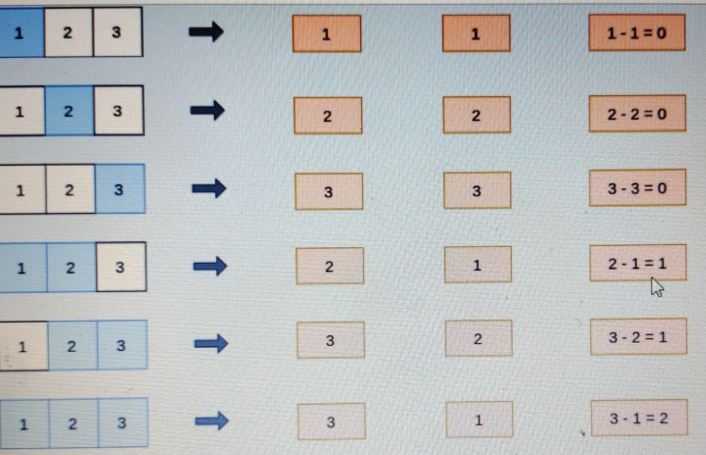

<h3>Problem: Smallest Difference</h3>

Amazon Logistics has multiple delivery centers from which products are sent.

In one such delivery center, parcels are placed in a sequence where the th parcel has a weight of weight[i]. A shipment is constituted of a contiguous segment of parcels. The shipment imbalance of a shipment is defined as the difference between the maximum and minimum weights within a shipment.

Given the arrangement of parcels, find the sum of shipment imbalance of all the shipments that can be formed from the given sequence of parcels.

Example

weights = [1, 2, 3]

The shipment imbalance calculations for each possible shipment are shown below.

The total shipment imbalance is 0+0+0+1 +1 +2 = 4.

Function Description

Complete the function getTotallmbalance in the editor below.

getTotallmbalance has the following parameter: int weight[n]: the weights of the parcels

Returns

long_int: the sum of shipment imbalance of all shipments

Constraints

• 1≤n≤105

• 1 ≤ weight[i] ≤ 105

<h3>Sample Input</h3>

    [1, 2, 3]

<h3>Sample Output</h3>

     4
