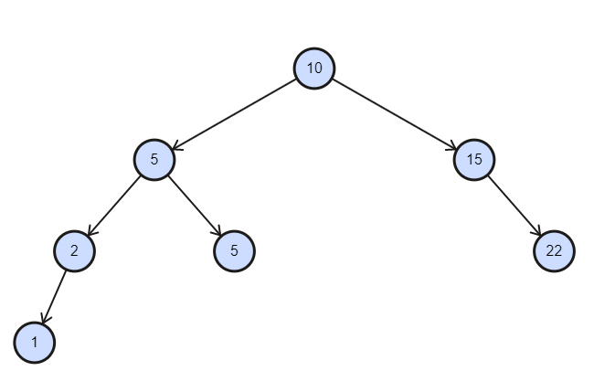

<h3>Problem: BST Traversal</h3>

Write three functions that take in a Binary Search Tree (BST) and an empty array, traverse the BST,
add its nodes' values to the input array, and return that array. The three functions should traverse the
BST using the in-order, pre-order, and post-order tree-traversal techniques, respectively.
If you're unfamiliar with tree-traversal techniques, we recommend watching the Conceptual Overview
section of this question's video explanation before starting to code.
Each BST node has an integer value , a left child node, and a right child node. A node is
said to be a valid BST node if and only if it satisfies the BST property: its value is strictly greater
than the values of every node to its left; its value is less than or equal to the values of every node
to its right; and its children nodes are either valid BST nodes themselves or None / null .

<h3>Sample Input<h3>

array = []

<h3>Sample Output<h3>

inOrderTraverse: [1, 2, 5, 5, 10, 15, 22]   // where the array is the input array
preOrderTraverse: [10, 5, 2, 1, 5, 15, 22]   // where the array is the input array
postOrderTraverse: [1, 2, 5, 5, 22, 15, 10]  // where the array is the input array
