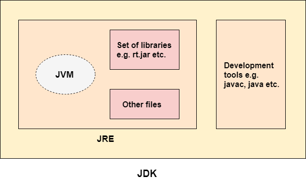

# Core Java

* jdk, jre, jvm - platform dependent.



* What is the output of below code:

> ```
> String s ="abc"
> s.concat("de")
> sysout(s)
> ```
>
> **Answer**: abc
>
> For updating: ```s = s.concat("de") ```

* Difference between String, StringBuilder, StringBuffer?

> * string is immutable
> * string buffer and builder is mutable
> * string buffer allows multiple thread where as string builder use single thread

* Thread means flow of execution
* Is it possible run without main() in java

> Yes.  By using static block.
> Static Block- By using static block when the class loaded into JVM, static methods/variables will be executed

* How we can create custom class as immutable:

> 1. Make the class as a final
> 2. the elements should be private
> 3. Class should have getter methods.
> 4. By using the constructor we can pass values

* Difference between static and final keyword?

> * static- single object, value can be changed
> * final- object value cannot be changed

* Differnce bw overloading and overriding?

> * Overloading- same method name with diff parameters
> * Overriding - same method with same parameters

* Is it possible by changing return type to achieve overloading?

> No
>
> ```
> int sum(5,9)
> double sum(5,7)
> ```
>
> It will be getting confused and reach to ambiguity.

* can we override static method? *No, not possible*
* can we overload main method?  *Yes*
* static keyword - means we cant override.
* Diff b/w final variable. final class, final method?

> final variable - can't change value
> final method - can't override(same class we cant have same function, same argument)
> final class -- can't extends

* Can we declare main() as final? – *No*
* Differnce between extends and implements

> * extends- class - a class extends b class
> * implements - a class implements a, b interfaces
> * If we need to use extends and impements, we need to have first extends and the implements
> * a class extends b implements c,d

* Is it possible: a class extends b class, c class?

> * Extend only one class
> * Implements multiple classes

* Difference between final, finalize, finally:

> * final is keyword used for variables, methods and classes
> * finally is a block used for continues flow execution, used in exception handling
> * finalize is a method it will cleanup the unused object. finally doesn’t require any catch block, if it is not there , it will be executed. If catch block throws exception, finally will be executed>

* Spring Annotation(@Bean) – *While running the spring application, the spring container will automatically load that class*
* How can we skip finally block- System.exit(0);
* Thread.sleep() can add a delay.
* How many ways we can create  a Thread? – 2 ways

> * extending a thread class
> * implements runnable inteface

* Which is better to create a thread?- implements runnable inteface

> * we can use implement runnable interface in multiple interface
> * Extends only one class

* What is serialization vs deserialization

> convert the object into stream- serialization
>
> convert the stream to object-  deserialization

* What are Marker Interface

> They don’t have any return type, method name eg: serialable, clonable
> Clonable- exact copy of the object

* What is singleton class?

> A singleton class is a class that can have only one object (an instance of the class)

* How can we define a singleton class?

> 1. Make constructor as private.
> 2. Write a static method that has return type object of this singleton class.

* Spring scope beans

> 1. **Singleton**- This scopes the bean definition to a single instance per Spring IoC container (default).
> 2. **Prototype**- This scopes a single bean definition to have any number of object instances.
> 3. **Request**- This scopes a bean definition to an HTTP request. Only valid in the context of a web-aware Spring ApplicationContext.
> 4. **Session**- This scopes a bean definition to an HTTP session. Only valid in the context of a web-aware Spring ApplicationContext.
> 5. **Global-session**- This scopes a bean definition to a global HTTP session. Only valid in the context of a web-aware Spring ApplicationContext.

#### * **Hashcode and equals**


| equals                                                                                                                                 | hashCode                                                                                                                                            |
| ---------------------------------------------------------------------------------------------------------------------------------------- | ----------------------------------------------------------------------------------------------------------------------------------------------------- |
| **equals** is a method in Java that acts similar to the == operator, which is to test for object identity rather than object equality. | **hashCode** is a method by which a class implicitly or explicitly break down the data stored in an instance of the class into a single hash value. |
| The method equals is used to compare two objects.                                                                                      | The method is used in hashing to decide which group an object should be placed into.                                                                |

* super keyword

The super keyword in java is a reference variable that is used to refer parent class objects.
The keyword “super” came into the picture with the concept of Inheritance.
It is majorly used in the following contexts:

1. **Use of super with variables**:
   This scenario occurs when a derived class and base class has same data members.
   In that case there is a possibility of ambiguity for the JVM. We can understand it more clearly using this code snippet:

```
/* Base class vehicle */
class Vehicle
{
    int maxSpeed = 120;
}

/* sub class Car extending vehicle */
class Car extends Vehicle
{
    int maxSpeed = 180;

    void display()
    {
        /* print maxSpeed of base class (vehicle) */
        System.out.println("Maximum Speed: " + super.maxSpeed);
    }
}

/* Driver program to test */
class Test
{
    public static void main(String[] args)
    {
        Car small = new Car();
        small.display();
    }
}
```

Output:

Maximum Speed: 120

2. **Use of super with methods**: This is used when we want to call parent class method.

```
/* Base class Person */
class Person
{
    void message()
    {
        System.out.println("This is person class");
    }
}

/* Subclass Student */
class Student extends Person
{
    void message()
    {
        System.out.println("This is student class");
    }

    // Note that display() is only in Student class
    void display()
    {
        // will invoke or call current class message() method
        message();

        // will invoke or call parent class message() method
        super.message();
    }
}

/* Driver program to test */
class Test
{
    public static void main(String args[])
    {
        Student s = new Student();

        // calling display() of Student
        s.display();
    }
}
```

Output:

This is student class
This is person class

3. **Use of super with constructors**: super keyword can also be used to access the parent class constructor. One more important thing is that, ‘’super’ can call both parametric as well as non parametric constructors depending upon the situation. Following is the code snippet to explain the above concept:

```
/* superclass Person */
class Person
{
    Person()
    {
        System.out.println("Person class Constructor");
    }
}

/* subclass Student extending the Person class */
class Student extends Person
{
    Student()
    {
        // invoke or call parent class constructor
        super();

        System.out.println("Student class Constructor");
    }
}

/* Driver program to test*/
class Test
{
    public static void main(String[] args)
    {
        Student s = new Student();
    }
}

```

Output:

Person class Constructor

Student class Constructor

#### * Dependency Injection - TODO

#### * Stereotypes annotation - TODO

#### * equals and == - TODO

#### * Abstract Class - TODO