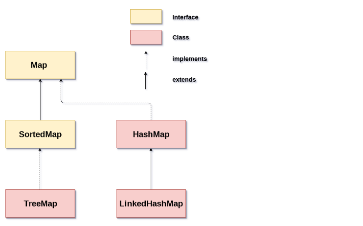

Map
------------        

storing elements in key- value

Hashmap, linkedhashmap, sortedmap, treemap, concurrenthashmap, hash table

HashSet and Hashmap
--------------------

hashset - set store only value, not keys
set Interface
no duplicate values
one null value

hashmap- store key and value
map interface
allow duplicate values
multiple null value

Hashmap vs treemap
-----------------
hashmap - no order
null key

treemap - ascending order map
no null key

Hashmap vs Hash table
---------------------
Hashmap - ASynchronous
one null key and multiple null values
multiple thread
HashTable - Synchronous
doesn’t allow any null key or value.
Single thread